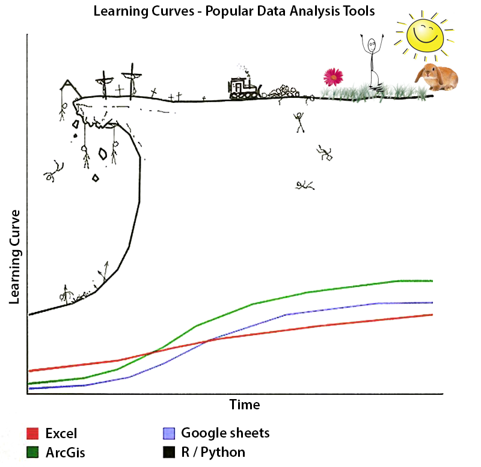
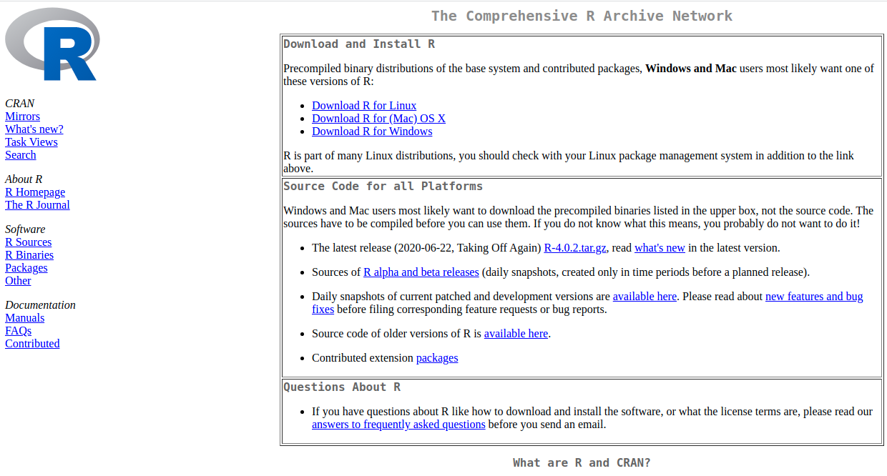
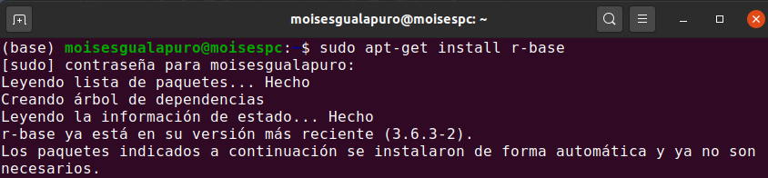
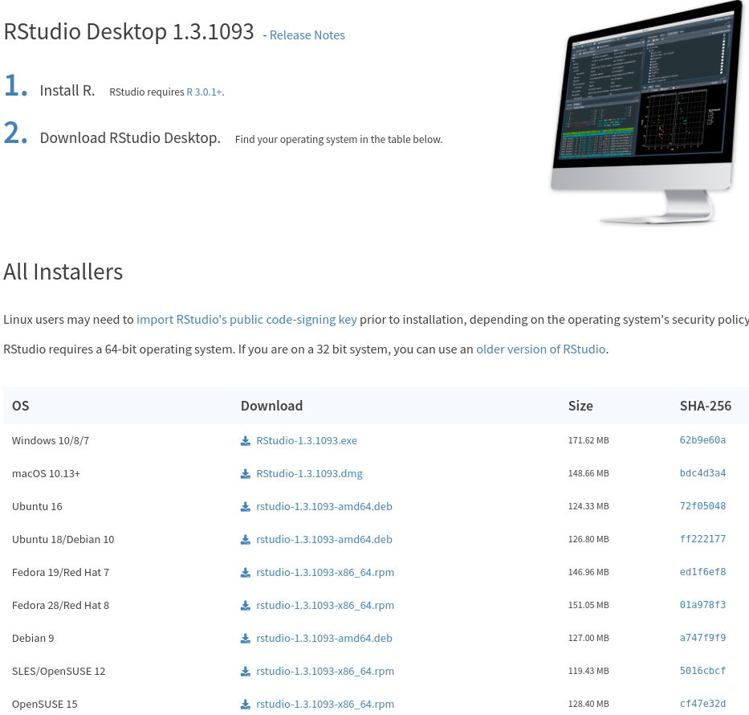
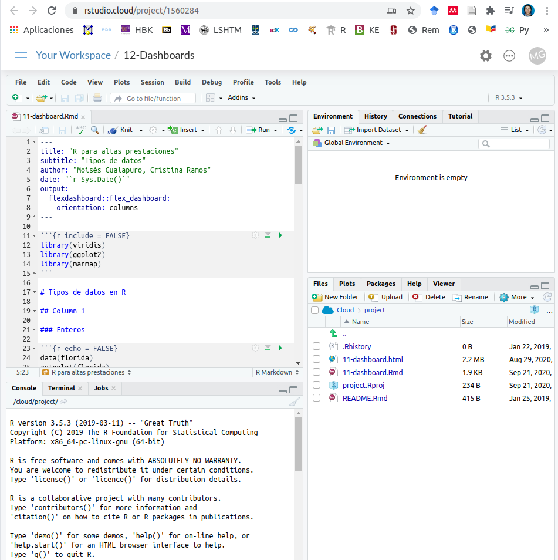
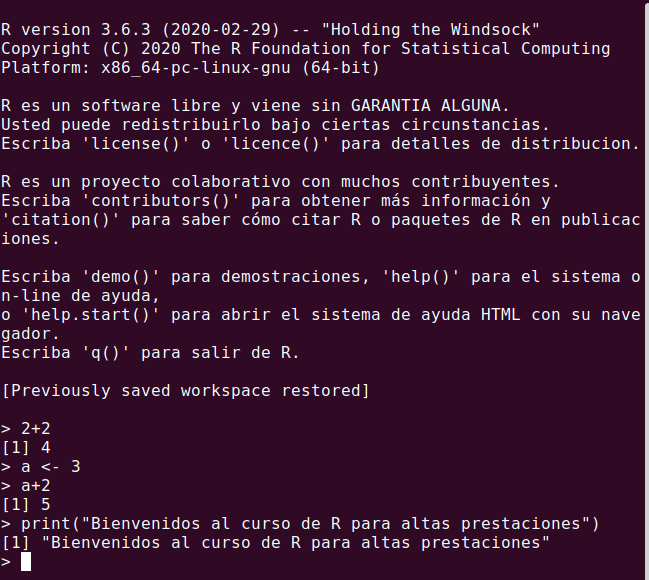
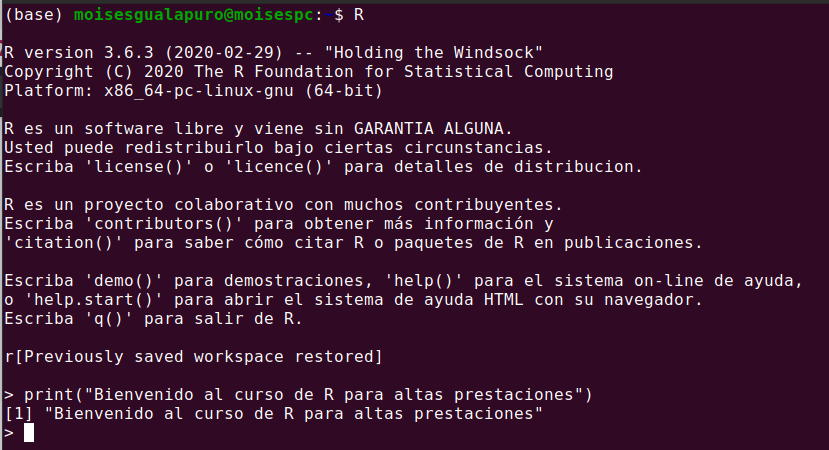
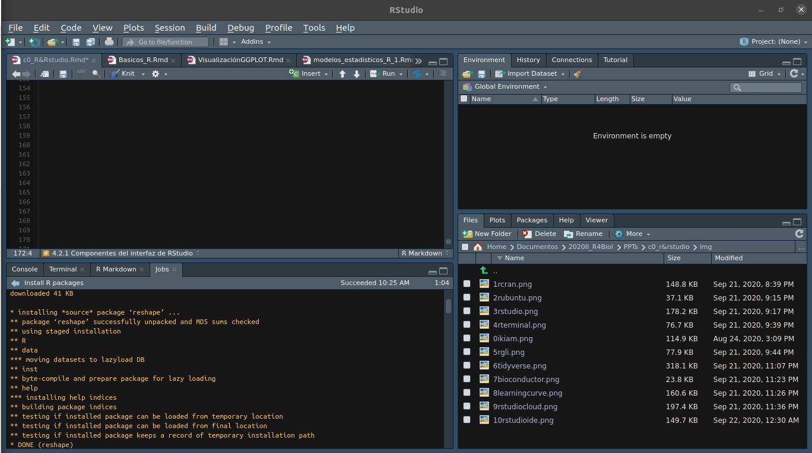
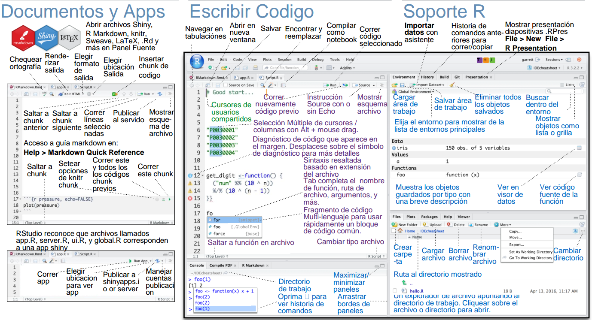
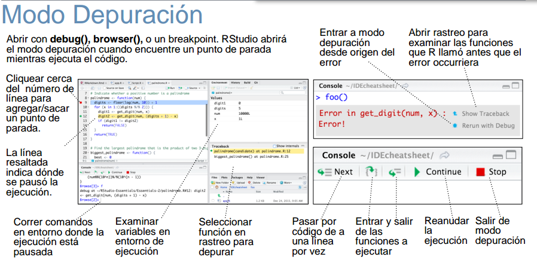

```{r warning=FALSE, message=FALSE,echo=FALSE}
rm(list=ls())         # borrar todo lo que haya en memoria
options(scipen=999)   # evitar notacion cientifica
options(encoding = "utf-8")

#Instalar librerias necesarias
if(!require(knitr)){install.packages("knitr")}
if(!require(readxl)){install.packages("readxl")}

library(knitr)

# Global options
 options(max.print="75")
 opts_chunk$set(message=FALSE,
                warning=FALSE)
  opts_knit$set(width=75)
```


Moisés Gualapuro  - `moises.gualapuro@ikiam.edu.ec` - Universidad Regional Amazónica IKIAM, Tena (Ecuador)

Cristina Ramos  - `cristina.ramos@ikiam.edu.ec` - Universidad Regional Amazónica IKIAM, Tena (Ecuador)

# CONTENIDO

# 1.0.1. Resultados de Aprendizaje

Al finalizar la unidad, el estudiante será capaz de:

- Instalar R y Rstudio en el equipo personal

- Crear su usuario en Rstudio cloud (https://rstudio.cloud/)

- Tener familiaridad con el entorno de Rstudio

# 1.0.2. Introducción

R es un lenguaje de programación para estadística computacional. Es un paquete de software libre disponible bajo GNU Licencia General Pública. R y sus librerías están diseñadas para estadística y visualización, entre ellas las estadísticas descriptivas, inferencias estadísticas y análisis de regresión.

## 1.0.2.1 Ventajas del uso de R

- Es compatible con todos los sistemas operativos (Linux, MacOS, Windows).

- Es un entorno integrado, especialmente desarrollado para el análisis de datos, los cálculos estadísticos y las representaciones gráficas. 

- Es un lenguaje de programación sencillo.

- Es **software libre**.

- Ampliamente usado en la investigación científica. 

- Permite crear visualizaciones de datos de alta calidad (ggplot).

- Permite crear dashboards para visualizar y analizar datos (Markdown, rKnit, Latex).

- Permite crear informes automáticos.

- Dispone de herramientas de análisis estadístico para ahondar en el conocimiento de los datos.

- Es reproducible.

- Interactividad en la visualización (shiny: https://shiny.rstudio.com/gallery/, plot.ly: https://plot.ly/r/line-and-scatter/).

- Comunidad de apoyo (StackOverflow: https://stackoverflow.com/questions/tagged/r, cross Validated: https://stats.stackexchange.com/, R Help Mailing List: https://stat.ethz.ch/mailman/listinfo/r-help, r-bloggers: https://www.r-bloggers.com/).

- Amplia disponibilidad de paquetes (https://cran.r-project.org/web/packages/available_packages_by_name.html, **tidyverse**: https://www.tidyverse.org/).

- Amplia disponibilidad de paquetes para ciencias de la vida (https://www.bioconductor.org/).


## 1.0.2.2 Desventajas del uso de R

- R podría consumir toda la memoria RAM disponible, dificulta el trabajo con datos masivos. 

- No se puede reclamar si algo no funciona.

- La calidad de algunos paquetes puede no ser ideal. 

- Al inicio no es user-friendly. La curva de aprendizaje es lenta al inicio, luego es exponencial. 

- Fácil equivocarse y no reconocer dónde se encuentra el error. 

 

# 1.0.3. Instalación de R y RStudio

## 1.0.3.1 Instalar R

R se puede descargar de https://cran.r-project.org; luego se debe seguir las instrucciones e instalar con las opciones predeterminadas.




En Ubuntu se ejecuta en el terminal: sudo apt-get install r-base.



## 1.0.3.2 Instalar RStudio

Después de instalar R, se debe instalar RStudio desde: https://rstudio.com/products/rstudio/download/; se debe seguir las instrucciones e instalar con las opciones predeterminadas.



### 1.0.3.2.1 RStudio Cloud

Ingresar a https://rstudio.cloud y crear un usuario como en cualquier plataforma  de correo o red social. 



# 1.0.4. Ambiente de R en el terminal y en RStudio

## 1.0.4.1 Consola de R o R en el terminal

La primera opción es abrir la consola de R base: 



La segunda opción es abrir el terminal (Ctrl + Alt + t) o la línea de comando (cmd) 



## 1.0.4.2 R en RStudio

La tercera opción es usar R con RStudio. 

"RStudio es un *integrated development environment* **(IDE)** para R. Incluye una consola, editor con resaltador-sintáctico que soporta la ejecución de código, asimismo herramientas de gráfica, registro histórico, debugging y administración del entorno de trabajo (workspace)"

Al abrir RStudio se tendrá la siguiente ventana: 



En el interfaz de RStudio se tiene 4 áreas, además de la barra de opciones en la parte superior.

- **Área Superior - Izquierda**: es el **editor de sintaxis**; se trata del lugar donde editamos la sintaxis para posteriormente ejecutarla. Al escribir allí no sucederá nada, a no ser que se apriete algún botón para ejecutar los comandos o la tecla ctrl+enter.

- **Área Superior - Derecha**: es el **“entorno de trabajo”** del programa: en este lugar se muestra el conjunto de datos y los “objetos” (resultados, variables, gráficos, etc.) que se almacenan al ejecutar diferentes análisis.

- **Área Inferior - Derecha**: paneles de **archivos**, de **salida**, de **paquetes** y de **ayuda**;  

  (i) la pestaña **files** permite ver el historial de archivos trabajados con el programa; 
  
  (ii) la pestaña **plots** permite visualizar los gráficos que se generen; 
  
  (iii) la pestaña **packages** permite ver los paquetes descargados y guardados en el disco duro así como gestionar su instalación o actualización;
  
  (iv) la ventana **help** permite acceder al CRAN - Comprehensive R Archive Network (siempre que se cuente con conexión a Internet), página oficial del software que ofrece diferentes recursos para el programa: manuales para el usuario, cursos on line, información general, descarga de paquetes, información de los paquetes instalados, etc. Esta última pestaña es bastante útil: empleando el motor de búsqueda se accede de manera rápida a manuales de uso de los diferentes paquetes (y sus funciones) instalados en el computador (esto no requiere conexión a Internet).7; 
  
  (v) la ventana **viewer** muestra los resultados al construir reportes mediante funcionalidades tipo rmarkdown.

- **Área Inferior - Izquierda**: es la **consola**. Corresponde a lo que sería el software R en su versión básica. Allí el software ejecuta las operaciones realizadas desde el editor de sintaxis.

### 1.0.4.2.1 Componentes del interfaz de RStudio

Las funcionalidades señalados a continuación están disponibles en:  https://github.com/rstudio/cheatsheets/blob/master/translations/spanish/rstudio-ide_Spanish_Translation_Monica_Alonso.pdf





# 1.0.5. Configuración base

Revisión de la versión de R

```{r}
version
```

## 1.0.5.1 Instalar paquetes

La versión predertimanada de R tiene varias funciones previamente cargadas. Por otro lado, se tiene funciones más especializadas que se desarrollan en forma de paquetes que se requieren ser instaladas desde el repositorio de R denominada **CRAN** (https://cloud.r-project.org/). Para revisar el paquete disponible debe dirigirse a la sección "Software/Packages". Aquí encontrará un aproximado de 16395 paquetes. 

Para instalar alguno de ellos se debe usar el código:

```{r}
# Revisar paquetes instalados
installed.packages("forensic")

# Instalar un único paquete, install.packages("nombrepaquete")
install.packages("forensic")

# Grupo de paquetes, install.packages(c("nombrepaquete1", "nombrepaquete2",...)) 
install.packages(c("tinytest", "abdiv"))

# Instalar solamente si se requiere
if(require("forensic")) install.packages("forensic")

# Actualizar un paquete
update.packages("car")

# Remover o desinstalar paquete(s) 
remove.packages("abdiv")

```

## 1.0.5.2 Ayuda
### Ayuda en R

Se puede utilizar la orden `` help("nombrefuncion") `` o `` ?nombrefuncion ``  o `` ??nombrefuncion_ `` 
```{r}
# Revisar información de ayuda y ejemplos. Se puede escribir:
# Ayuda de una función
?mean
help(mean)
??sqrt
help(sqrt)

# Ayuda de un paquete: Se puede escribir 
??ggplot

```

La información de ayuda se desplegará en la ventana inferior-derecha, donde se muestra la: descripción, usos, argumentos, valores, referencias y ejemplos. Si la función es implementado en varios módulos, se presentará el listado de módulos para seleccionar.   

### Ayuda en fuentes externas

Si la información disponible en _Help_ es insuficiente o no logra corregir algo por cuenta propia, se recomienda hacer la busqueda del tema en plataformas como: 

- R-project: https://www.r-project.org/help.html 

- RStudio support: https://community.rstudio.com/

- Stackoverflow: https://stackoverflow.com/questions/tagged/r 

- Cross Validated: https://stats.stackexchange.com/

- R-bloggers: https://www.r-bloggers.com/

- GitHub: https://github.com/search?l=R&q=R+programming&type=Repositories 


# 1.0.6. Referencias para refuerzo

- Items de cada componente de la interfaz de RStudio: http://wpd.ugr.es/~bioestad/guia-r-studio/practica-1-r-studio/

- Textos de R: https://rstudio.com/resources/books/ 

- Guías rápidas (Cheatsheets) de algunos paquetes de R, disponibles en: https://github.com/rstudio/cheatsheets
